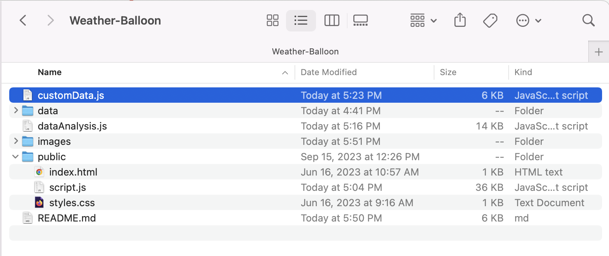
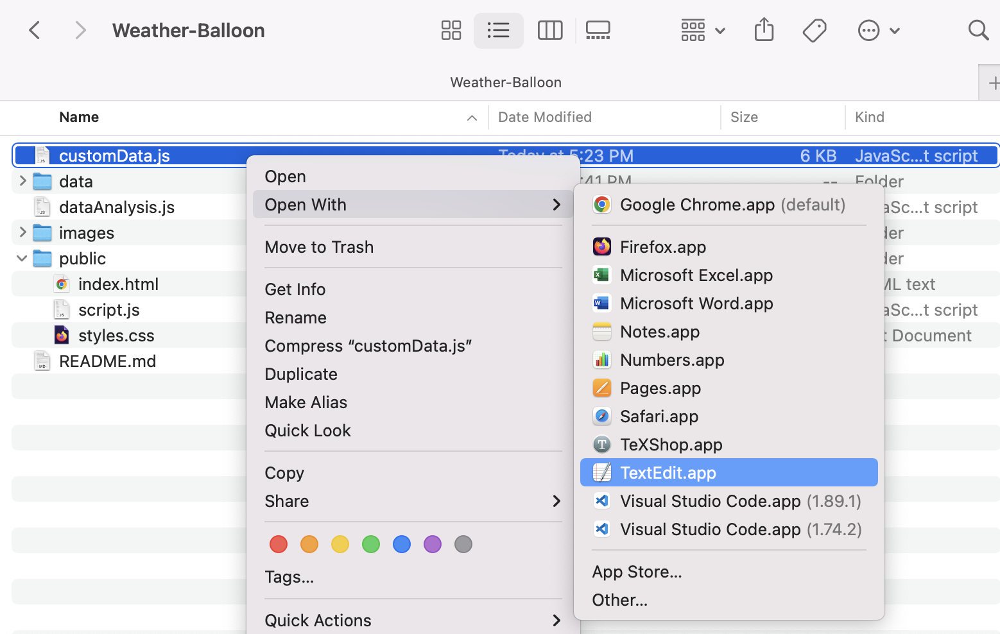
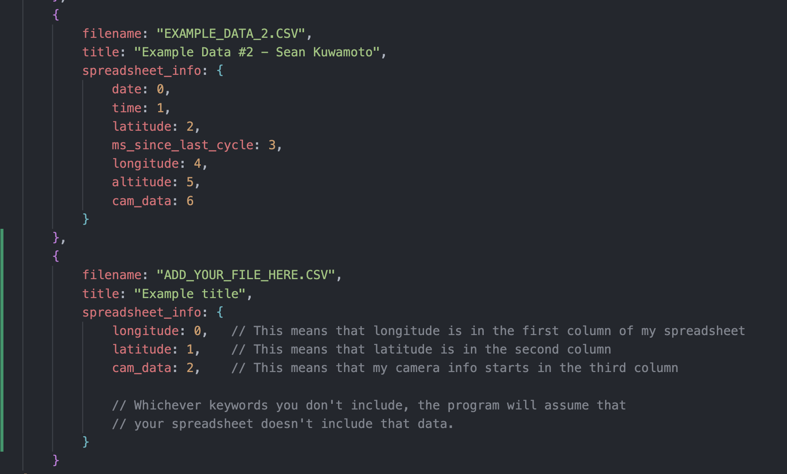
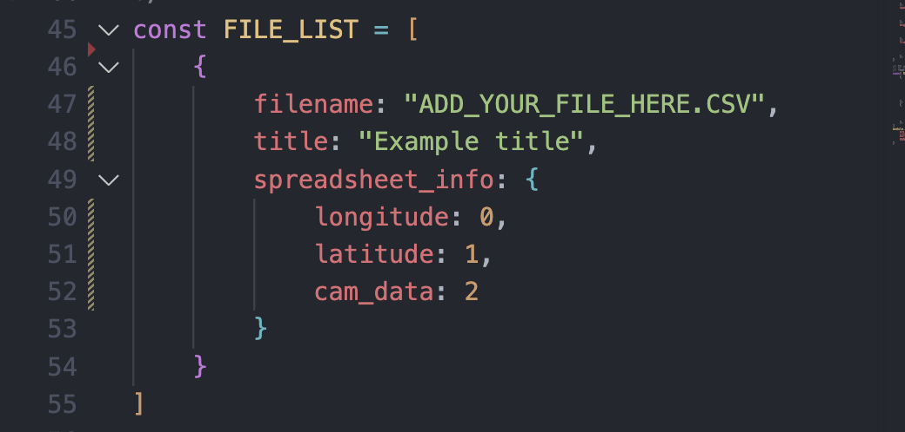

# Weather-Balloon

https://github.com/Seankuwamoto/Weather-Balloon/assets/56642599/1bc506f5-7f29-4b41-9468-55374250a190

---
## Contact me
For bug reports or questions, please shoot me an email at sean.kuwamoto@gmail.com. I'd be happy to spend some time helping you get your data to work!
## Usage instructions

### Step 1: Installing Node
This project runs on [Node](https://nodejs.org/en), a JavaScript runtime environment.

Before getting started with my code here on github, you'll need to install node by clicking [this link](https://nodejs.org/en/download/package-manager) and following the instructions.

In case you have trouble with the instructions on Node's website, I'll also walk through the steps of installing it on a Mac here.

The first step is to open up terminal on your Macbook. Terminal is an application that is automatically installed on all Macbooks, and you can acess it by pressing <kbd>Cmd</kbd> + <kbd>Space</kbd> and then searching `terminal`.

Once inside terminal, you should copy and paste the following line into the terminal and press enter:
```bash
curl -o- https://raw.githubusercontent.com/nvm-sh/nvm/v0.39.7/install.sh | bash
```
This should install nvm (Node version manager) onto your computer. From here, you should restart terminal so that you can use nvm.

With nvm, you can install the latest version (version 20) of node onto your computer by putting the following command in terminal:
```bash
nvm install 20
```

After this, you should be done! To check that everything is working, you can use the following two commands. The parts after the hashtags are comments, and not actually what you should type into terminal.
```bash
# verifies the right Node.js version is in the environment
node -v # should print `v20.14.0`
# verifies the right NPM version is in the environment
npm -v # should print `10.7.0`
```

### Step 2: Downloading the code to your computer
At the top of this repository, you should see a green button labeled `Code`. By clicking on this, then pressing `Download ZIP`, you can download all of my code to a zip file on your computer.


After navigating to this zip file in your finder and double-clicking on it, it will become unzipped and create a folder in your downloads called Weather-Balloon. 

Move this folder to wherever you would like to have it, preferably somewhere like `documents` or `desktop` so that it doesn't get lost in your downloads. Make sure to remember where you put it, you'll need that later.
### Step 3: Downloading the needed packages
To install the needed npm packages for this project, you will first need to **naviagate into the project directory** in the terminal. Right now your terminal is dealing with your whole computer, but you want to move into the project folder so that you can run files and install packages inside it. Your terminal should look something like this:


if not, run the command
```bash
cd
```
and you will be brought to the home directory. From there, you will want to either navigate into `Desktop` or `Documents`, depending on where you put your file. Personally, I keep my weather balloon folder on my desktop, so I run the command 
```bash
cd Desktop
```
to navigate into my Desktop. From there, I will run
```bash
cd Weather-Balloon
```
to move into the `Weather-Balloon` folder. To make sure that it worked, you can run the `ls` command and it should **l**is**t** all of the files in your current directory. You should see it print out things like `dataAnalysis.js` and `customData.js`.


Once your in, there are **five** npm packages you need to install: `express`, `http`, `socket.io`, `fs`, and `colormap`. To install these packages, enter the following five commands into the terminal:
```bash
npm install express
```
```bash
npm install http
```
```bash
npm install socket.io
```
```bash
npm install fs
```
```bash
npm install colormap
```
Once you do that, everything should be all set up! The repository comes with two example csv files already installed, so if you'd just like to see the program working you can skip step 4 and head to step 5.
### Step 4: Putting your spreadsheet in
You should have a `.csv` file with your weather balloon data in it. Make a copy of it, and move it into the `data` folder in `Weather-Balloon`. There should be two other `.csv` files in there, called `EXAMPLE_DATA_1.csv` and `EXAMPLE_DATA_2.csv`. You can leave them there for now.



Now you should head over to customData.js. You'll need to make changes to it in order for your data to show up, and you can use the builtin Mac text editor `textEdit` or a code editor like `VSCode`.



Once open, you can take a look at the instructions inside `customData.js` and then scroll down to the `FILE_LIST` and begin adding the information for your csv file:



To add your own data, add a comma after the end of the second example file's curly braces and create a pair of your own. In it, you must include the name of your file in a section called `filename`, a title (it can be whatever you want), and `spreadsheet_info`. Here you will say what data from your spreadsheet you want to include and which column it can be found in. The column indices start from 0, so 0 means the first column, 1 means the second column, and so on. 

Only certain keywords can be used to include columns of data:
> `date`, `time`, `ms_since_last_cycle`, `fixed`, `latitude`, `longitude`, `altitude`, `speed`, `angle`,`satellites`, `avg_thermistor`, `thermistor_c`, `gyro_x`, `gyro_y`, `gyro_z`, `accel_x`, `accel_y`,`accel_z`, `mag_x`, `mag_y`, `mag_z`, `live_cam`, `cam_data`, `pressure`, `humidity`

If there is a sensor that you have that is not on this list, you can contact me and I can try to change it, or you can "lie" and use one of these keywords for a different purpose. I.e. if you had a Geiger counter in the first column and wanted to graph its data, you could just write `pressure: 0` and it would take in the Geiger counter readings as pressure.

Once you've made your changes, make sure to save them by going to `File > Save` or pressing <kbd>Cmd</kbd> + <kbd>S</kbd>.

If you want, you can also remove the two examples from `customData.js` so that it's just your data. Then, your `FILE_LIST` might look something like this:



### Step 5: Running the code
Once everything is setup, you can open up your terminal, navigate to `Weather-Balloon` if you haven't already (see step 3), and run the following command:
```bash
node dataAnalysis.js
```
Hopefully, it should look something like this:


Now, you can visit the link here: [http://127.0.0.1:3000](http://127.0.0.1:3000)
or by holding <kbd>Cmd</kbd> and double-clicking on the link in the terminal. This is the website!

Anytime you make changes to `customData.js`, you must restart terminal and rerun the program for them to show up. You can quit the program by pressing <kbd>Cmd</kbd> + <kbd>C</kbd> while in terminal, or by restarting the terminal application. Then to restart the program, all you have to do is navigate back to the `Weather-Balloon` folder (see step 3), and then run
```bash
node dataAnalysis.js
```
again.

### Step 6: Using the website

https://github.com/Seankuwamoto/Weather-Balloon/assets/56642599/1bc506f5-7f29-4b41-9468-55374250a190

The website has many features, but all of them are pretty straightforward. The slider at the bottom of the graph lets you sift through your frames. You can use <kbd>Space</kbd> to play/pause the slider, and you can use <kbd>&#8592;</kbd> and <kbd>&#8594;</kbd> to go through frame by frame. If you tap the left or right arrow in quick succession, it will move you through 1/50th of your total frame count as opposed to just one frame.

For the graph, you can scroll up and down to zoom in and out. To change which variables are on the axes, you can click on one of the axes, then click on the variable you would like it to become. 

At the bottom, there are three buttons which toggle various settings for the website. Show grid lines and scatter plot are fairly self-explanatory, and abs. temp locks the camera into coloring each frame relative to a fixed temperature scale instead of having each pixel be colored relative to the other pixels in the current frame. 

If you have any questions, please contact me at sean.kuwamoto@gmail.com!
### Step 7: Further customization

In the `customData.js file`, there is also a section called `EXTRA_SETTINGS`. Here, you can specify the lables and data ranges of each different type of data.

NOTE: This is necessary if you want your data to graph properly. To tune the ranges to the correct sizes, I reccomend setting them to a large window (i.e. graphing your temperature from -100 deg to 100 deg) and then looking at the website to see how your data is graphed. From there, you can go back and shrink your ranges to match the high and low points of the graph.